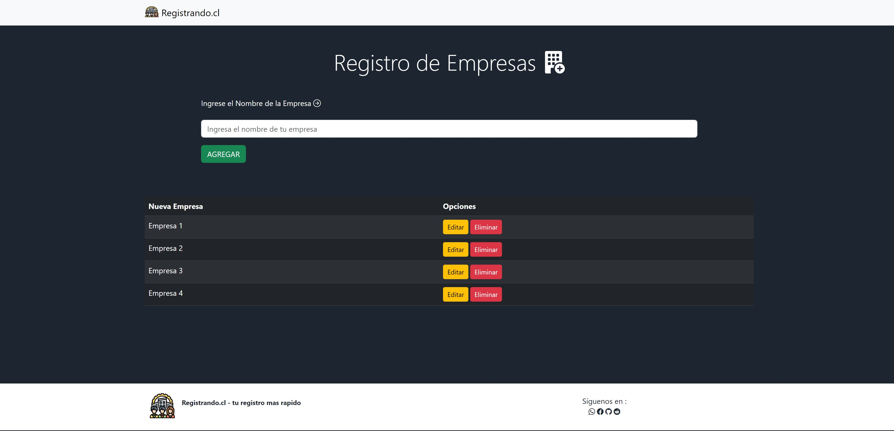
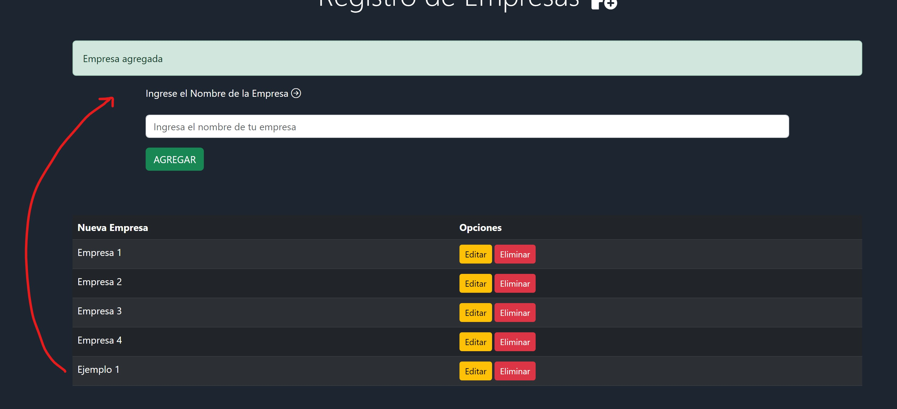
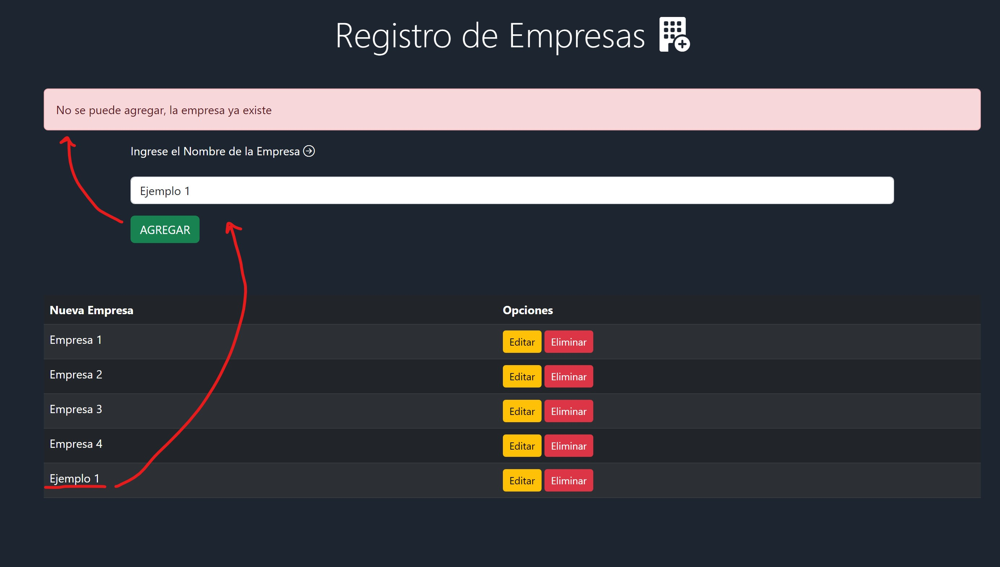
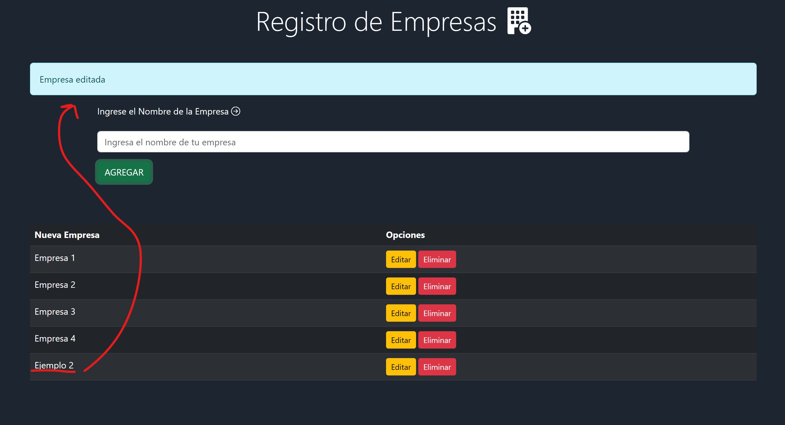
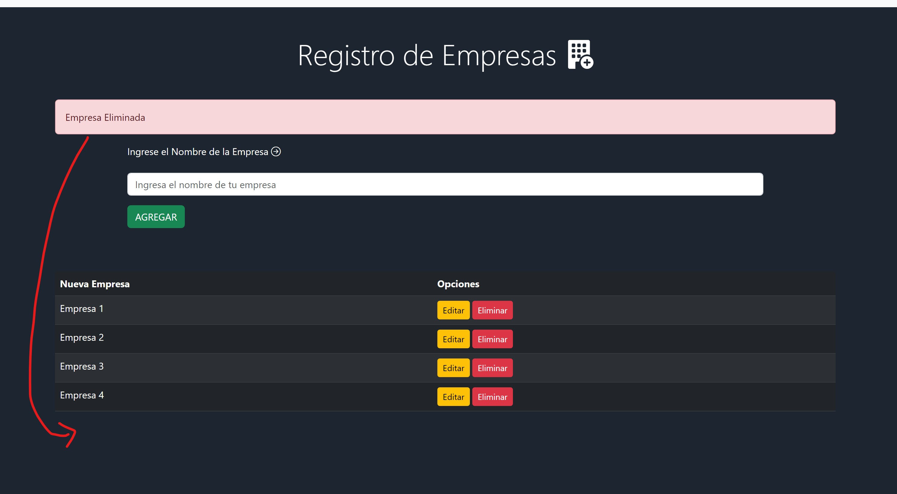

# Proyecto CRUD JS 💻✨
Este proyecto es un ejemplo de una aplicación CRUD (Crear, Leer, Actualizar, Eliminar) enfocada en la gestión de empresas. La aplicación permite a los usuarios realizar las operaciones básicas de un sistema CRUD para administrar información de empresas, y todos los datos se almacenan en el LocalStorage del navegador.
Este proyecto CRUD de creación de empresas con almacenamiento en LocalStorage busca proporcionar una herramienta simple y funcional para gestionar información empresarial de manera eficiente. Siéntete libre de utilizarlo como punto de partida para tus propios proyectos o para aprender sobre el uso de LocalStorage en aplicaciones web.
## Descripción de proyecto 📑
> El objetivo principal de este proyecto es proporcionar a los usuarios una interfaz intuitiva y sencilla para crear, ver, actualizar y eliminar registros de empresas. La aplicación está diseñada para brindar una experiencia de usuario fluida y eficiente en la gestión de datos.

## Capturas de pantalla 📷

Asi vemos la interfaz en un primer vistazo

Aqui vemos las alertas generadas cuando agregamos una empresa

Se validan los campos y no se puede ingresar una empresa existente

Edita y muestra alerta del proceso

ELimina y muestra alerta

## Links 📎

+ Visitar el proyecto : https://asalazar1123.github.io/Crud-js/ 💻
+ Visitar Perfil:  [GitHub](https://github.com/asalazar1123)  👨‍💻
+ Contacto : salazaralexander2@gmail.com  📥

## Tecnologías ⚡

- HTML
- CSS
- BOOTSTRAP
- JAVASCRIPT
-------------
